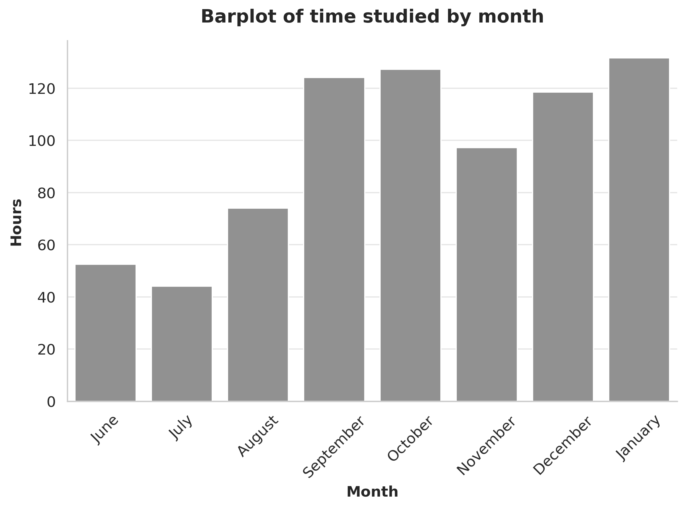
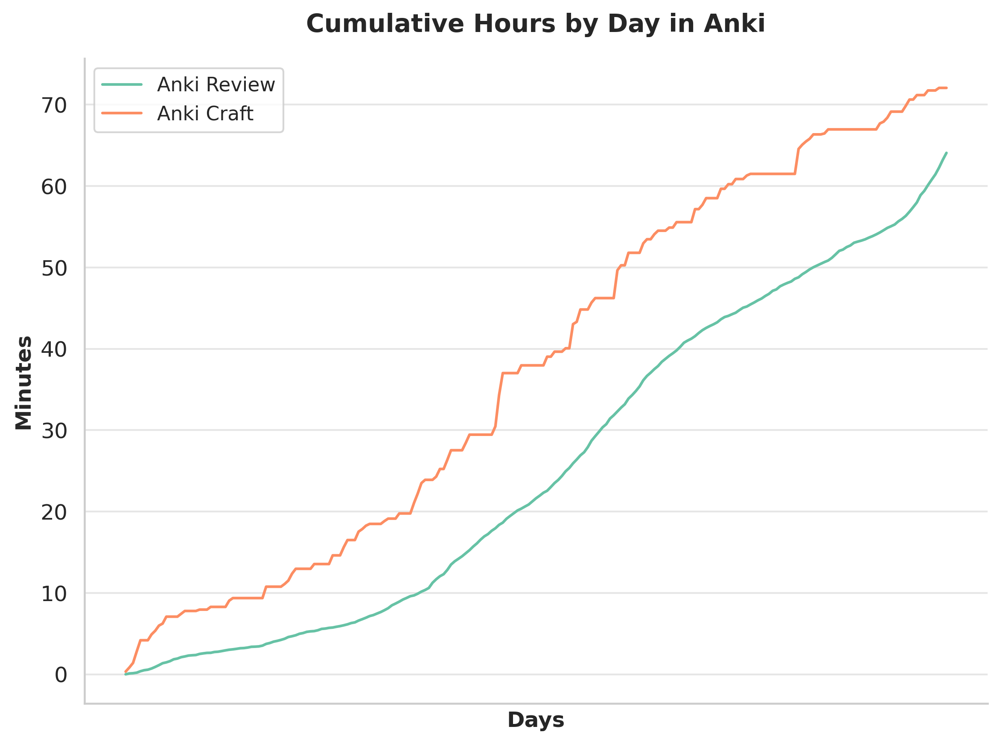
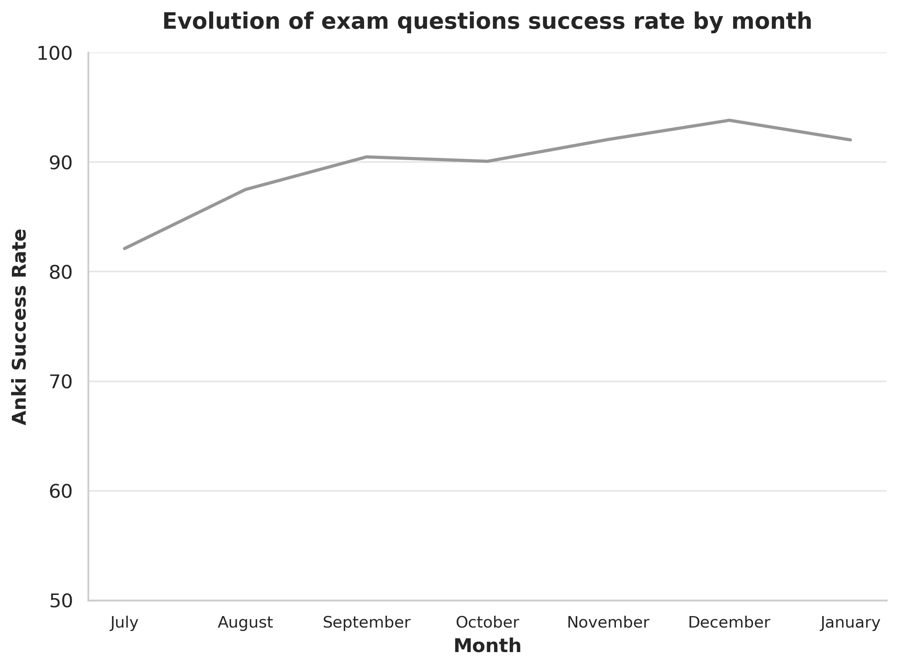
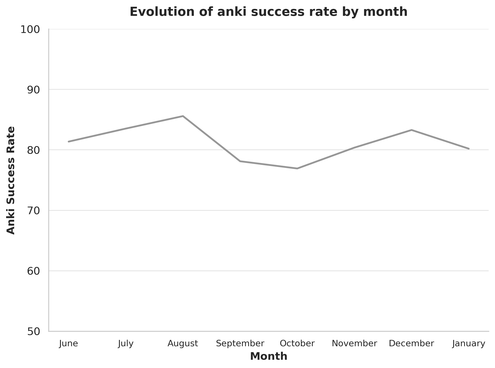
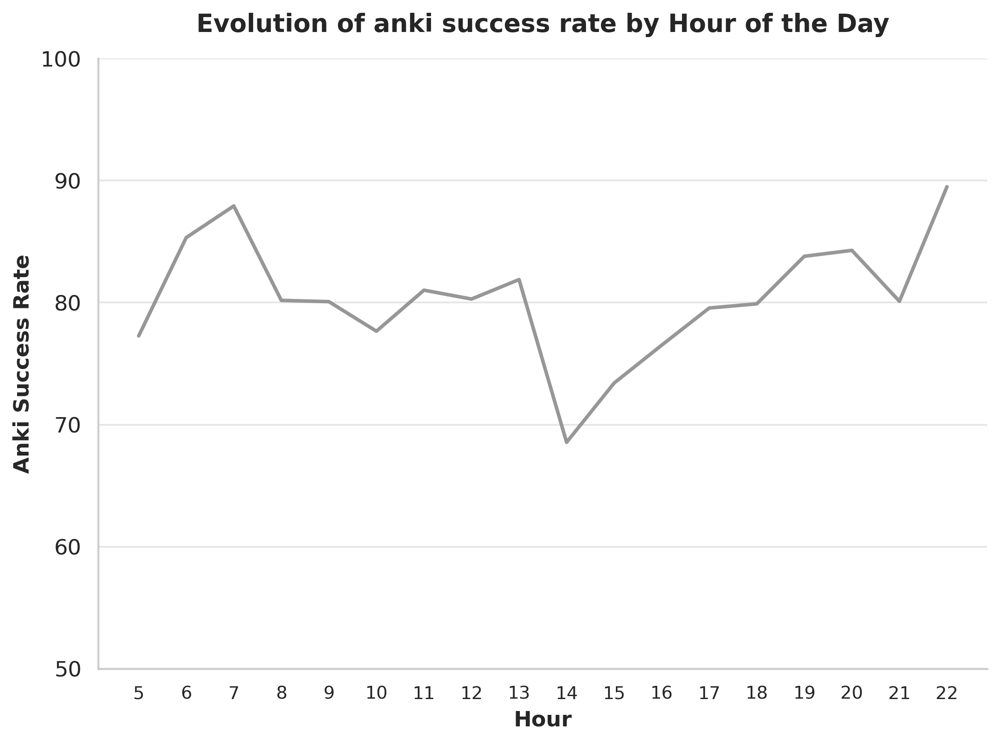
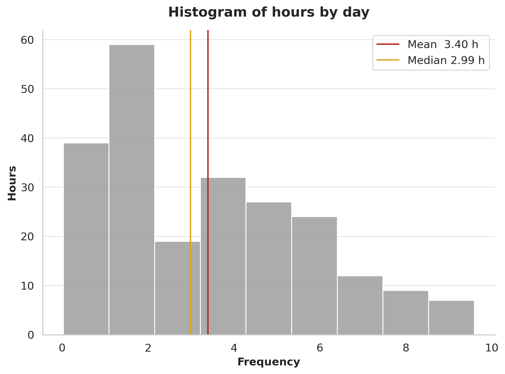
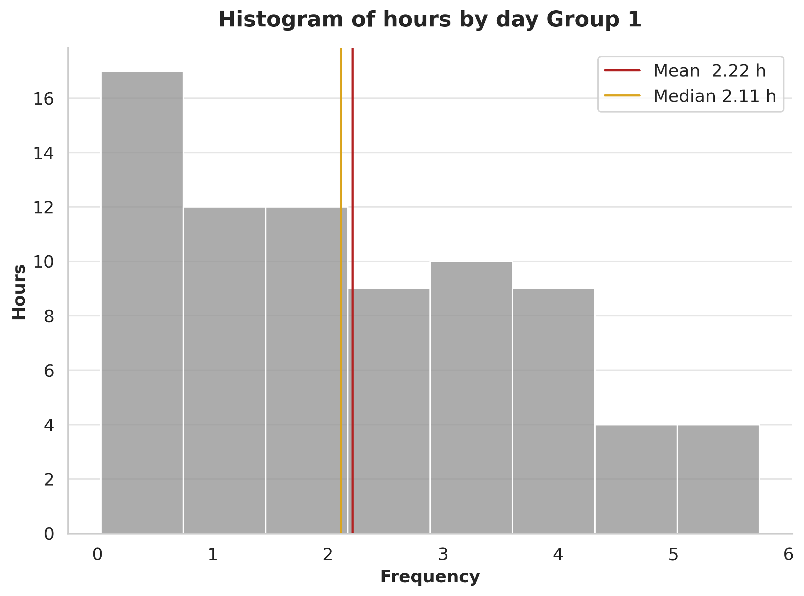
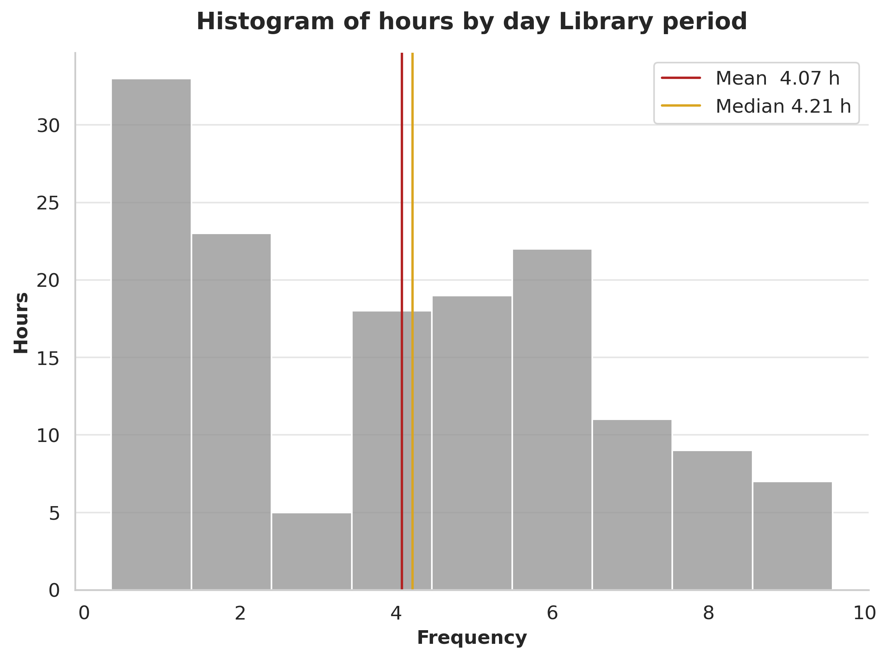
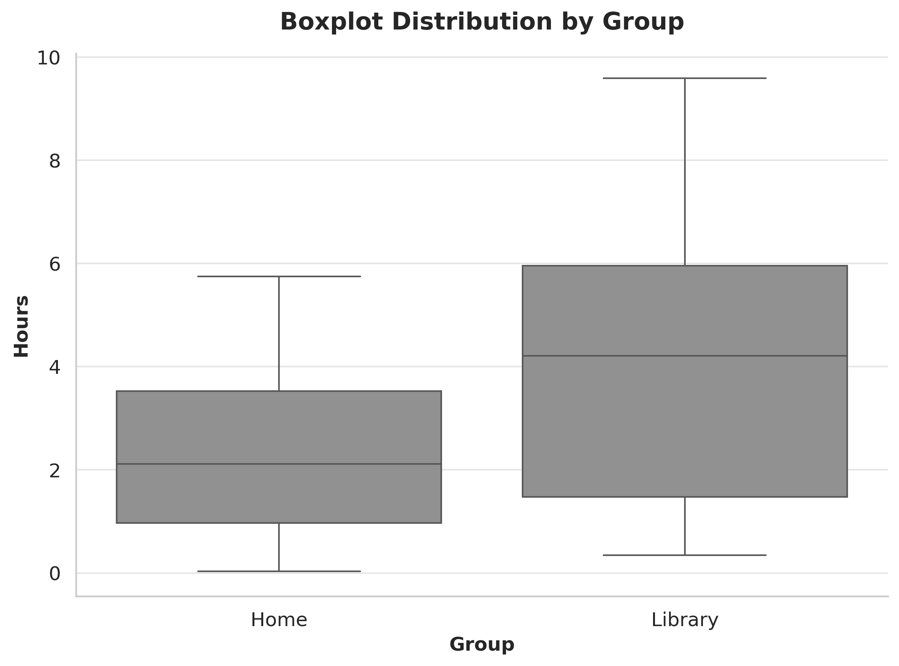

# BIR by the Numbers: My Study Journey in Data

## Why I did it

Last year I decided to go all-in for a spot as an Internal Resident of Biology (BIR).  
I was using the [Flowmodoro tool](https://github.com/Oddman43/Flowmodoro) to time-block my study sessions and log every focused minute, while Anki handled active recall. Thanks to [Anki Connect](https://git.sr.ht/~foosoft/anki-connect) I could also export every review timestamp.

The result: an 8-month sprint, studying every single day. I finished in the top 100… but only 50 spots were available.

My logged activities:

- **Lectures** – video lessons  
- **Bear Hunter System** – encoding framework from [i can study](https://www.icanstudy.com/)  
- **Active Recall** – periodic brain-dumps
- **Anki Craft** – creating new cards  
- **Anki Review** – reviewing cards  
- **Exam Questions** – official or mock tests

## Some funny numbers (descriptive stats)

I clocked **774.4 h** in total, averaging **3.4 h/day** (mean) and **2.99 h/day** (median).

The biggest chunk went to the *Bear Hunter System* (**336 h**, ≈ 45 %), followed by exam questions (**140 h**) and active recall (**117 h**).

I didn’t skip a single study day from **17 Jun 2024** to **25 Jan 2025**, keeping a **224-day streak** alive; the leanest day was just **0.03 h** of Anki reviews.

My peak week was the one right before the exam (**13–19 Jan 2025**) with **48 h** accumulated, including my all-time daily record of **9.59 h**.

January leads the ranking, with October close behind. November logged noticeably fewer hours than both neighbours a first red-flag for burnout, yet study sessions continued and the December upswing shows the fatigue was real but reversible.

## Which hours was I more productive?

I expected the classic “early-bird” peak: 8 am – 12 pm.  
To test it I built a day-vs-hour heat-map of focused minutes.

The data killed my assumption.  
Top-3 most productive slots (normalised to 0-1):

1. Tue 16-17 h (1.000)  
2. Mon 17-18 h (0.979)  
3. Tue 17-18 h (0.967)

The whole **16-18 h weekday block** beats my **10-12 h morning slot**.  
Turns out the post pandrial deep never clocked in: 4–6 pm is when I hit peak focus.

### Intresting correlations I found

Week-end Anki reviews concentrated between 11:00 and 13:00, allowing the queue to be cleared early in the day.

Exam-question cards were scheduled in the afternoon, coinciding with the 16:00–18:00 peak-efficiency window.
On weekends they were usually started at 08:00–10:00; if unfinished, they extended into 18:00–20:00.

Bear Hunter System sessions, which demand the highest cognitive load, were systematically placed in the 09:00–11:00 weekday block, but usualy spilled over to post-lunch periods.

## Anki-related facts

### Time invested in creation versus review

The balance between crafting new cards and reviewing them was a key metric.  
Recorded times show **72 h** devoted to creation and **64 h** to review, yielding an **8 h surplus**.

The difference is considered beneficial: authoring cards constitutes an additional encoding step and permits micro-study during breaks or commuting periods.

### Success-rate progression

Exam-question cards exhibited the expected trajectory, with success rates exceeding **92 %** in December and January.  
User-generated cards displayed an inverse pattern: high accuracy in the initial months, a pronounced decline in September–October, and a subsequent recovery—most likely attributable to the large influx of new cards during that period.

At hourly resolution, the **14:00–15:00** interval shows a marked drop in success for own cards, falling below **70 %** versus the usual **> 80 %**, consistent with reviews performed during lunch breaks under divided attention.

### Largest decks

**Card count**  
1. Bacteriology – 263  
2. Nervous system – 211  
3. Immunology – 189  
4. Parasitology – 147  
5. Hematology – 145  

**Review time**  
1. Bacteriology – 7.95 h  
2. Nervous system – 5.32 h  
3. Parasitology – 4.14 h  
4. Immunology – 4.02 h  
5. Hematology – 3.22 h  

Both rankings coincide in high-memorisation content, confirming the expected workload distribution.

## Library effect

From June to January the distribution of daily hours shows a positive skew (mean **3.4 h**, median **2.99 h**).  
Starting in September I commuted to the local library every weekday; the visual shift suggests higher productivity away from home.

To quantify the difference the sample was split into two periods:

- **Home period**: June – August  
- **Library period**: September – January  

Shapiro-Wilk tests rejected normality for both groups (*p* < 0.05); therefore a two-sample Mann-Whitney U test was applied.  
The result indicates a statistically significant difference (*U* = …, *p* < 0.001), confirming that daily study time was higher during the library phase.