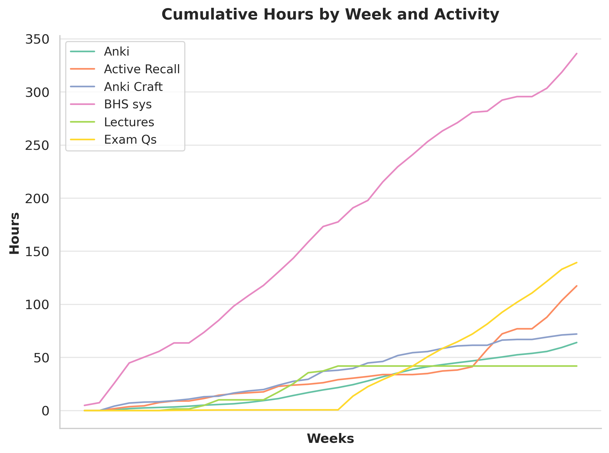
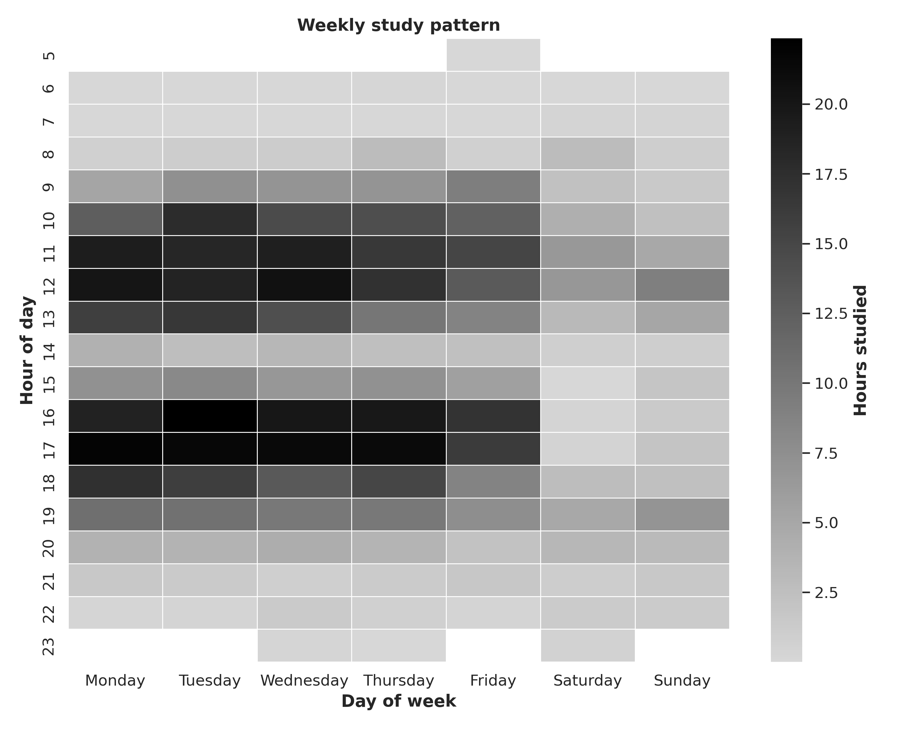
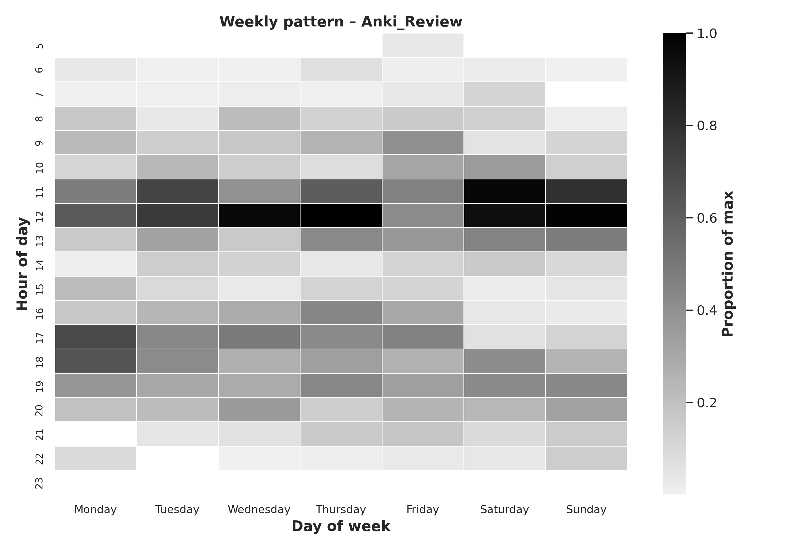
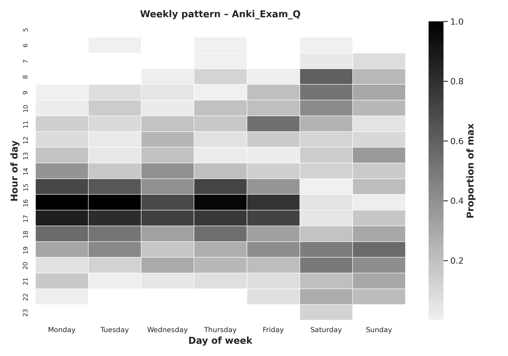

# 🚧 Work in Progress 🚧

# BIR by the Numbers: My Study Journey in Data

## Why I did it

Last year I decided to go all-in for a spot as an Internal Resident of Biology (BIR).  
I was using the [Flowmodoro tool](https://github.com/Oddman43/Flowmodoro) to time-block my study sessions and log every focused minute, while Anki handled active recall. Thanks to [Anki Connect](https://git.sr.ht/~foosoft/anki-connect) I could also export every review timestamp.

The result: an 8-month sprint, studying every single day. I finished in the top 100… but only 50 spots were available.

My logged activities:

- **Lectures** – video lessons  
- **Bear Hunter System** – encoding framework from [i can study](https://www.icanstudy.com/)  
- **Active Recall** – periodic brain-dumps
- **Anki Craft** – creating new cards  
- **Anki Review** – reviewing cards  
- **Exam Questions** – official or mock tests

## Some funny numbers (descriptive stats)

I clocked **774.4 h** in total, averaging **3.4 h/day** (mean) and **2.99 h/day** (median).

The biggest chunk went to the *Bear Hunter System* (**336 h**, ≈ 45 %), followed by exam questions (**140 h**) and active recall (**117 h**).

I didn’t skip a single study day from **17 Jun 2024** to **25 Jan 2025**, keeping a **224-day streak** alive; the leanest day was just **0.03 h** of Anki reviews.

My peak week was the one right before the exam (**13–19 Jan 2025**) with **48 h** accumulated, including my all-time daily record of **9.59 h**.

## Which hours was I more productive?

I expected the classic “early-bird” peak: 8 am – 12 pm.  
To test it I built a day-vs-hour heat-map of focused minutes.

The data killed my assumption.  
Top-3 most productive slots (normalised to 0-1):

1. Tue 16-17 h (1.000)  
2. Mon 17-18 h (0.979)  
3. Tue 17-18 h (0.967)

The whole **16-18 h weekday block** beats my **10-12 h morning slot**.  
Turns out the post pandrial deep never clocked in: 4–6 pm is when I hit peak focus.

### Intresting correlations I found

Week-end Anki reviews concentrated between 11:00 and 13:00, allowing the queue to be cleared early in the day.

Exam-question cards were scheduled in the afternoon, coinciding with the 16:00–18:00 peak-efficiency window.
On weekends they were usually started at 08:00–10:00; if unfinished, they extended into 18:00–20:00.

Bear Hunter System sessions, which demand the highest cognitive load, were systematically placed in the 09:00–11:00 weekday block, but usualy spilled over to post-lunch periods.

## Anki-related facts

## Library effect
